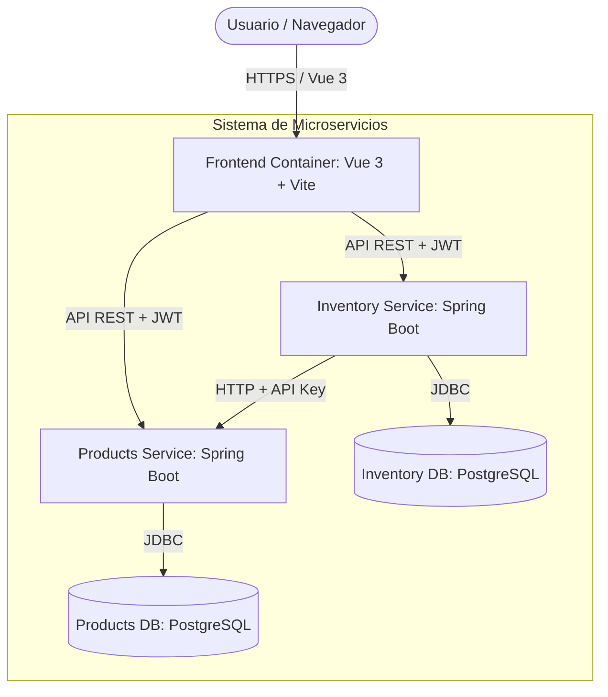

# Arquitectura C4 - Nivel 2: Contenedores

## Escenario de Compra de Productos

### Componentes:

1. **Frontend**: Aplicación Vue 3 que maneja la interacción del usuario, estado con Pinia y seguridad con JWT.
2. **Products Service**: Gestiona el catálogo de productos. Expone endpoints públicos (JWT) y privados (API Key).
3. **Inventory Service**: Gestiona el stock y las transacciones de compra. Implementa resiliencia y control de concurrencia optimista.
4. **Bases de Datos**: Esquemas separados en PostgreSQL para mantener el desacoplamiento de los microservicios.
